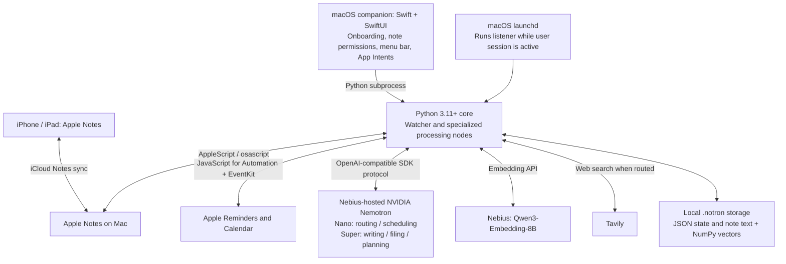
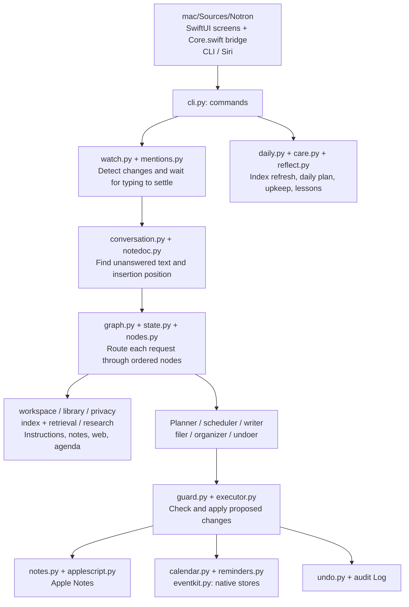

# Notron product and readiness assessment

Assessment date: September 4, 2026. Scope: current repository, local application bundle, and the two relevant Ask Notron exchanges in the listener log. No product code changed.

## Recommendation

Keep the product promise narrow: **capture a thought in Apple Notes; Notron puts it where it belongs and helps turn explicit requests into reminders and calendar entries.** Short contextual conversation supports that promise. It is essential for corrections, clarification, and natural follow-ups, without requiring an unlimited general-purpose chat product.

Current readiness: **developer alpha, suitable for continued owner testing; not ready for an unattended consumer installation or paid public launch.** A small assisted pilot should follow the privacy, write-safety, and onboarding fixes below.

The strongest differentiator is reduced organization effort inside an existing habit. Customization through About Me, filing destinations, per-note permissions, layout, and memory is useful. The modules make future expansion possible, but the repository does not implement a general plugin marketplace, isolated extension runtime, or consumer skills editor. Expand templates and bounded workflows before expanding tool access.

## Technology schematic

The OpenAI Python package is a client protocol adapter; it does not make OpenAI the inference provider. Verified model defaults in `notron/brain.py`:

| Role | Exact model ID |
|---|---|
| Fast routing / scheduling | `nvidia/NVIDIA-Nemotron-3-Nano-30B-A3B` |
| Writing, planning, filing, organization | `nvidia/nemotron-3-super-120b-a12b` |
| Configured deep tier | `nvidia/Nemotron-3-Ultra-550b-a55b` |
| Embeddings | `Qwen/Qwen3-Embedding-8B` |

No active deep-tier call site was found. These are configured IDs, not a new verification of provider availability. The local `.env` points at `https://api.studio.nebius.ai/v1/`; the source default is `https://api.tokenfactory.nebius.com/v1/`. No model overrides were found in that file; a separately configured process environment could override defaults. No hosted Notron backend or server database is implemented here. The Swift package targets macOS 14+; the existing local app binary is arm64.

## Codebase schematic

This is an ordered Python workflow, not a collection of independently running AI agents. Nodes skip work they do not own. Separating model proposals from execution is a good foundation. Boundaries are not uniformly enforced yet: not every outbound model input passes privacy filtering, and multi-step writes are not transactions.

## Ask Notron: confirmed root cause

The local log at `.notron/listen.log:2338` onward contains:

1. “What are Dark Energy and Dark Matter?” — answered using five web sources.
2. “Can you dumb it down a bit for me?” — router explanation correctly identified a request to simplify a previous explanation, but the answer defined “dumbing it down” and linked to simplification tools.

`watch.py:check_ask` extracts the unanswered question and passes only that text into `graph.run`; `here` remains empty. `State` has standing memory and retrieved context but no conversation-history field. The router sees only `state.request`. The writer receives no preceding Ask answer. A rule then forces any question with neither note retrieval nor requested web access into web search, which searches the isolated phrase.

A synthetic, in-memory reproduction confirmed the follow-up reaches the graph with `here == ""` and only the new sentence as its source. This does not require changing model providers or buying a larger model.

**Recommended experience:** preserve a short thread in the Ask note, initially the last few relevant exchanges under a token limit; provide a clear “New topic” boundary; recognize corrections and transformations before deciding to search. Use preceding turns for reference resolution in both routing and writing. A request such as “make that simpler” should reuse the previous answer; a follow-up needing new facts can still search. History must stop at the current question when someone inserts a question higher in the note.

Keep conversation memory separate from permanent Memory. Do not infer permanent preferences from every follow-up. Include the IDs of actions actually completed, so references such as “that reminder” point to real objects. If ambiguous, ask one short clarification. Preserve existing restrictions: a follow-up cannot silently grant new rewrite permission or enable unsupported calendar edits.

Suggested acceptance cases: simplify previous answer; “what about the other one?”; new topic; follow-up inserted mid-note; deleted prior answer; repeated wording in separate threads; pasted text containing Notron's signature; unsupported “move that meeting”; a single thought entered over a long typing pause.

## Mac sleep and phone capture

**Processing requires an awake Mac, the user's running listener, access permissions, and internet for cloud AI.** Closing the lid normally sleeps a laptop, although an externally configured Mac can remain awake. A powered-on sleeping Mac is insufficient. The background job is a user LaunchAgent, not an always-on cloud service.

Expected sequence when out with a phone:

1. You add text to an iCloud Brain Dump note. Apple Notes holds/syncs that text independently of Notron.
2. While the Mac sleeps, Notron does no filing or new reminder creation.
3. After wake, login/session availability, and iCloud sync, the listener reads the current note.
4. Brain Dump is checked approximately every minute and waits for an unchanged set of unfiled lines for 900 seconds. Newly observed phone changes normally start that wait then. A previously observed unchanged batch may already have satisfied the wall-clock wait during sleep. Restarting the listener resets these in-memory timers.
5. Filing copies text into its destination and ticks the original with a receipt; the changed notes can sync back to the phone.

Ask Notron polls every five seconds and requires six seconds of unchanged text, plus model/search/write time. These are scheduling intervals, not response-time guarantees. A slow request blocks other work in the single loop. “File my brain dump” requests filing without the automatic 15-minute settling wait.

iCloud Notes requires Notes sync enabled and the same Apple Account. A local “On My Mac” note does not provide the intended phone loop. The installer currently does not verify this prerequisite. See [Apple's Notes setup guidance](https://support.apple.com/en-gb/guide/icloud/-mm8685520792/icloud).

Once a timed reminder is actually created and synced to the phone, Apple Reminders handles its notification independently of the Mac. Before that, a request typed into Notes is only pending text. Brain Dump filing itself does not turn every reminder-shaped thought into an alarm.

The most consequential offline gap: there is no original per-request capture timestamp/timezone. Scheduling resolves “tomorrow” against processing day; journal filing uses the filing date for its heading. After a weekend away, requests and journal entries can be associated with the wrong day. Explicit dates help but do not replace a proper delayed-request policy.

## Readiness findings, in priority order

| Priority | Finding and evidence | Required outcome |
|---|---|---|
| Before pilot | **Privacy filter bypass.** `index.build` sends readable note chunks to `brain.embed` without redacting them. A synthetic credential inside a normal note reached the mocked embedding call. Direct requests, tagged-note context, About Me/Memory, and organizer input also have paths without equivalent filtering. | A shared outbound privacy boundary for inference, embeddings, and search; explicit cloud disclosure; exclusion before initial indexing. This confirms a code path, not an assertion that a particular real credential was transmitted. |
| Before pilot | **Read-only does not always mean read-only for filing.** `filer.masters` restricts destinations only when `lib.homes` is nonempty. If the user chooses zero homes, other eligible readable notes become candidates. | Distinguish unconfigured from deliberately configured zero homes; respect the GUI's stated permission meaning. |
| Before pilot | **Rewrite can overwrite concurrent edits.** `organizer` generates from an earlier body; `Executor._apply` checks concurrent changes only for append/insert/mark, not replace/restore. Even those checks are not atomic across devices. | Check expected note revision for rewrite and undo; refuse stale writes; test delayed iCloud edits and preserve attachments. |
| Before pilot | **Retries can duplicate completed work.** Event/reminder creation precedes the Notes receipt; filing appends to the destination before ticking the source. If the second step fails or the process crashes, the outstanding request can run again. | Durable operation IDs and recovery records: repeated delivery must not create a second effect. |
| Before pilot | **First-install onboarding is incomplete.** Swift points to `/Users/m1labs/Dev/apps/juno` and its virtual environment; listener installation also assumes `.venv`. GUI does not provision Python, credentials, seed notes, or initial indexing. | A complete installation independent of this repository and developer account. |
| Before pilot | **Permission “Allow” is not a full request path.** Calendar/Reminders checks read authorization status; they do not explicitly request access. Swift repeatedly invokes that same check. Notes probing can prompt, but EventKit status inspection is different. | Implement requests under the shipped app/helper identity and test a fresh macOS account with no prior Terminal grants. |
| Before pilot | **Consent comes after activation.** Start listening precedes Your Notes. All three app permissions are mandatory. | Choose note access before reading/sending content; allow a useful Notes-only setup; explain read and write access accurately. |
| Before pilot | **Status and stop controls mislead.** `is_running` checks registration, not worker health. GUI Quit terminates only SwiftUI. “I'll do this later” marks onboarding done without a menu action to start the listener. | Real last-success/heartbeat status, offline/error recovery, pause/resume, and a clearly defined quit action. |
| Before paid launch | **No release-grade package.** Existing `.app` is ad-hoc signed, lacks a team identity and bundled Python; no DMG creation/update pipeline was found. Checked-in plist has Siri usage text but not the Notes/EventKit usage descriptions needed for a finished permission design. | Bundled runtime, writable Application Support state, Developer ID signing, appropriate entitlements/usage descriptions, notarization, update/uninstall path. |
| Before pilot | **Context and delayed work.** Missing Ask history and capture-time dates undermine basic corrections and offline requests. | Bounded threads; explicit stale/ambiguous request handling. |

Apple documents an explicit EventKit access request separately from reading authorization status: [requestFullAccessToEvents](https://developer.apple.com/documentation/eventkit/ekeventstore/requestfullaccesstoevents(completion:)). Release packaging should follow [Apple's notarization guidance](https://developer.apple.com/documentation/security/notarizing-macos-software-before-distribution). The exact helper/permission design needs a real fresh-install test; existing Terminal access is insufficient evidence.

## Additional real-world cases to account for

| Scenario | Current limitation / product decision |
|---|---|
| Two Macs run Notron against the same notes | Local locks/state do not coordinate across computers. Duplicate replies/actions and racing full-body writes are possible. Support one active Mac until ownership is coordinated. |
| Mac offline; API credits exhausted; model request slow | Watcher retries, but errors are mainly in logs. No explicit product-level model timeout/cost cap; sequential work can stall the queue. Show pending/error state without implying completion. |
| Permission state JSON becomes corrupt | `library.load()` falls back to an empty permissive configuration. Use atomic persistence, backups, and a failure state that preserves restrictions. |
| Search immediately after adding a note | Semantic index refresh occurs through the index command or morning routine, not every watcher pass. Existing index can be stale. Validate freshness or retrieve changed notes directly. |
| “Finish the invoice reminder” with similar titles | Completion uses title matching, including substring matching, rather than a confirmed stable target. Ask when more than one plausible reminder exists. |
| Misspelled work calendar/list | Creation silently falls back to the default destination. Report an unmatched name instead of placing work in a personal calendar. |
| “Every weekday at 9”; “move tomorrow's meeting”; several tasks at once | Scheduler extracts one action; recurrence and event modification are not represented. Support explicit boundaries and explain unsupported requests. |
| Date-only reminder; appointment without duration | Alarm is added only when a time is supplied. Events default to 60 minutes; invalid end ordering is replaced with that duration. Ask or visibly confirm assumptions. |
| Travel, DST, “9 AM London time” | Parsing uses naive local dates; positive offsets/Z can be discarded, negative offsets are unsupported. Locale-dependent note timestamps recognize only two English formats. |
| Busy week or many overdue reminders | Calendar/reminder context is capped; conflict checking is not a deterministic calendar overlap gate. Do not imply every commitment was checked. |
| Notes with images, scans, tables, checklists, or locks | AI receives text rather than full native-note semantics. Rewrite reconstructs text/HTML and is not proven to preserve attachments and rich objects. Exclude unsupported rewrite content pending tests. |
| Shared notes / copied web text containing instructions | Text origin is not equivalent to owner authorization. Restrict execution from shared/untrusted text; keep retrieved material separate from executable instructions. |
| Duplicate titles, accounts, renames, moved folders | Reads know IDs, but proposed note writes resolve by folder/title. Account identity is not represented in `Note`. Stable IDs should carry through execution. |
| Brain Dump gets edited continuously | Auto-filing keeps waiting, deliberately. Make the delay discoverable and provide a clear “file now” action. |
| User edits after Notron then asks to undo | Undo stores one whole prior body, not a selective change reversal. It can remove later user edits; require a revision check. |
| User uninstalls the GUI or changes computer | Listener and local state need explicit removal/migration. Preferences, undo, and index do not sync just because Notes does. |

These are code-derived risks or unsupported cases, not claims that every scenario has already failed in production. The code already handles several important cases: settling while typing, retry cooldowns for unanswered questions, re-resolving deleted Ask/Brain Dump IDs, persisted mention tracking, restricted action types, preserving text on append/insert, and one-level note undo.

## Launch gates and measurement

1. Close outbound privacy, permission semantics, concurrent rewrite, and duplicate-action gaps.
2. Ship bounded Ask conversation and a predictable delayed-request policy.
3. Complete the real installation flow: setup → cloud/access explanation → choose notes → initial preparation → start → verify one successful round trip. Notes-only use should work without calendar access.
4. Run a small assisted pilot using a signed build on fresh accounts and devices. Exercise sleep/wake, restart, denied/revoked permissions, poor network, concurrent phone edits, and API failure halfway through an action.
5. Expand only after measuring correct filing, corrections needed, duplicate/lost operations, time to first useful result, visible failure recovery, weekly retention, and model cost per active user.

A defensible initial promise is “Capture from any device; Notron organizes when your Mac is awake.” If immediate phone execution becomes essential, that requires an additional execution surface or an always-awake Mac. Hosting inference alone does not supply access to Apple Notes while the Mac sleeps.

## Verification and limits

- Python: all **371 tests passed**, exit code 0. Tests use fake Notes and do not validate live iCloud sync or model quality.
- Swift: fresh build succeeded in `/private/tmp/notron-assessment-build`; eight concurrency warnings in Onboarding/Library would become errors under Swift 6 language mode.
- Inspected local application signature: ad-hoc, no TeamIdentifier, arm64. A distributable notarized DMG was not found in the inspected repository.
- Reproduced missing Ask context and unredacted embedding input with synthetic data and mocked APIs; no real secret or note was sent for these probes.
- Reviewed GUI source and compilation, not a clean-account interactive installation or visual accessibility walkthrough. No fresh permissions were granted, no live Notes content was edited, and no real calendar/reminder action was executed for this assessment.
- No unit-cost, market-demand, or retention estimate is claimed from this single-developer installation. Customization potential is an architectural assessment, not demand validation.
