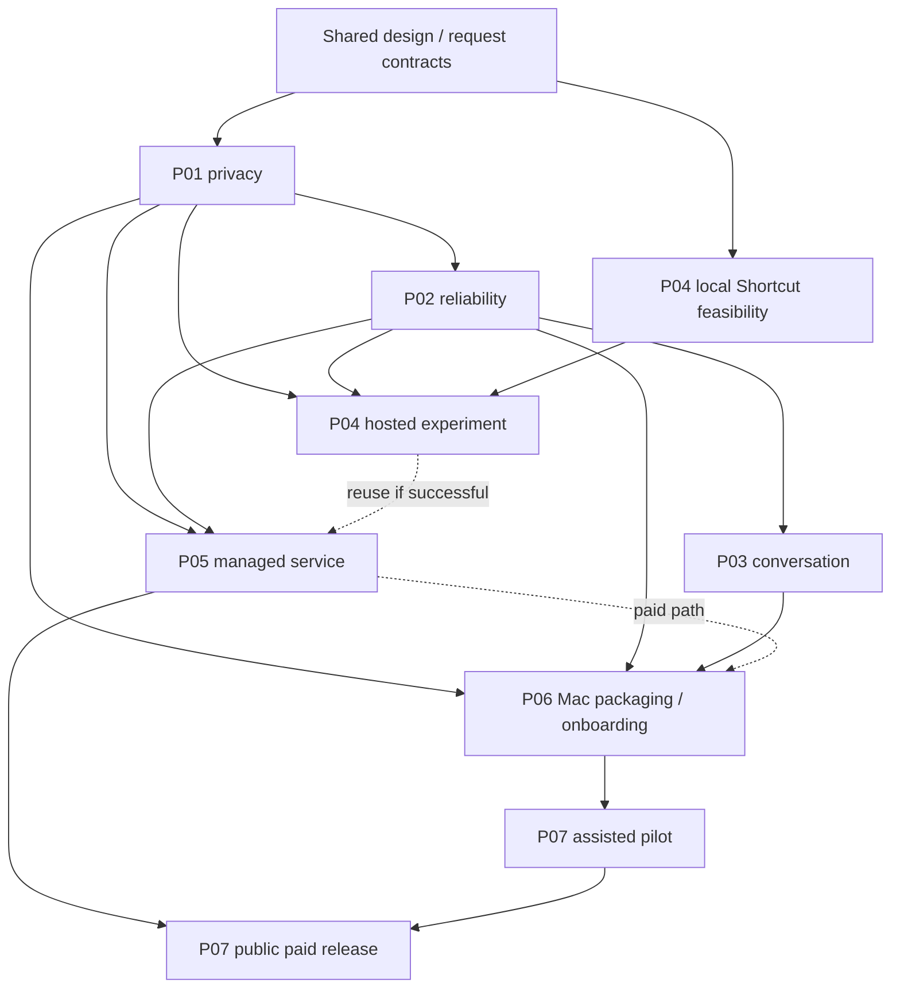

# Notron production roadmap

Status: **implementation in progress; P01 Tasks 1–5 and P02 Tasks 1–2 complete; native secure-startup gate pending P06**. Updated 2026-09-05.
Evidence: [P02 Tasks 1–2 batch handoff](handoffs/2026-09-05-P02-tasks-1-2.md), [P01 Task 5 session handoff](handoffs/2026-09-05-P01-task-5.md), [security report](evidence/P01-security-boundaries.md), [secure storage evidence](evidence/P01-secure-storage.md) and [outbound caller map](evidence/P01-outbound-map.md).
Audience: the owner and an engineer starting a fresh coding session.

## Outcome and scope

Build a safe assisted pilot, then earn a public paid release through evidence. Notron remains a small organizer inside Apple Notes: capture, filing, contextual questions, and explicit reminder/calendar creation. The primary customer is Becky: a nontechnical Apple Notes user with a regularly used Mac. Mobile-only demand is a separate validation question.

The owner approved this direction in the September 4 planning conversation. This roadmap makes those defaults concrete. Detailed mechanisms below are implementation proposals, not claims that the product already has them. Creating plans does not authorize charging customers, contacting testers, publishing releases, purchasing infrastructure, or uploading personal notes.

Read the [shared design and contracts](design.md) before any plan. Findings are grounded in the [product assessment](../assessments/2026-09-04-product-readiness.md), with further security findings from the subsequent conversation included here. The [coverage map](coverage.md) shows which task owns each issue.

## Plan index

| ID | Plan | Prerequisite | Exit deliverable | Status |
|---|---|---|---|---|
| P01 | [Privacy and permissions](plans/01-privacy-permissions.md) | Shared design | Private inputs, credentials, permissions and network destinations have enforced boundaries | Local implementation complete — Tasks 1–5; private reporting decision and native P06/P07 gates open |
| P02 | [Reliable execution and recovery](plans/02-reliable-execution.md) | P01 policy APIs | Durable operations, guarded writes, safe retries and stale-request handling | Tasks 1–2 complete; Task 3 next |
| P03 | [Ask conversation](plans/03-ask-conversation.md) | P01; P02 request contracts | Bounded contextual follow-ups and clarification | Planned |
| P04 | [Mobile Shortcut feasibility](plans/04-shortcut-prototype.md) | Local experiment can start immediately; hosted test requires P01 and P02 contracts | Real-iPhone evidence and explicit continue/stop decision | Planned |
| P05 | [Accounts and paid service](plans/05-accounts-service.md) | P01; P02 contracts; P04 backend contract if experiment proceeds | Authenticated, metered service with server-enforced access | Planned |
| P06 | [Mac installer and onboarding](plans/06-mac-distribution.md) | Runtime work can start after P01; completion uses P02/P03; paid path uses P05 | Portable signed app, truthful onboarding/status, updates and uninstall | Planned |
| P07 | [Pilot and public release](plans/07-pilot-release.md) | Gate requirements below | Measured pilot, security review and release decision | Planned |

Do not execute whole plans concurrently if they edit the same modules. P01 owns policy and outbound input first; P02 owns request/execution contracts next. P03 then extends those contracts. P04 owns a separate user-triggered mobile surface, never another autonomous watcher. Packaging research and synthetic Shortcut tests can happen independently.

## Milestones and release gates

### M0 — plans and feasibility framing

- [x] Record the agreed product scope and shared contracts.
- [x] Create seven subsystem plans and session handoff template.
- [ ] Verify available Mac/iPhone hardware and Apple signing access through P06/P04 inventories.
- [ ] Execute the synthetic-only Shortcut action inventory; record actual OS version and action behavior.

### M1 — safe local core

- [x] P01 passes its privacy, zero-home, corruption and outbound-network regressions (Task 5: 664 full-suite passes; synthetic evidence only).
- [ ] P02 passes crash/retry, concurrency, stale-date, undo and single-worker checks.
- [ ] P03 passes follow-up and clarification fixtures, including the actual two-question example.
- [x] All existing tests pass after deliberate behavior updates; no live Notes access in unit tests (798 passed at the P02 Tasks 1–2 checkpoint; rerun as subsequent tasks land).

### M2 — assisted pilot

- [ ] M1 complete; no unresolved critical/high security or data-integrity finding.
- [ ] P06 signed, notarized installation works in a fresh account without development tools.
- [ ] Notes-only setup works; optional Calendar/Reminders grants do not block it.
- [ ] Pilot has an immediately usable AI access path: managed invite accounts from P05, or explicitly disclosed owner-assisted BYO setup. Do not represent BYO testing as proof of zero-setup consumer onboarding.
- [ ] Independent security review covers the shipped bundle and the hosted service if used.
- [ ] P07 restore, support and stop procedures rehearsed using test data.
- [ ] Mobile experiment is clearly optional and is advertised only for behaviors actually proven by P04.

### M3 — public paid release

- [ ] M2 evidence accepted, P05 completed, final paid onboarding exercised in P06.
- [ ] Subscription lifecycle, usage enforcement, account deletion, device revocation and outage behavior tested.
- [ ] Update/rollback/revocation chain verified; help, privacy disclosures and billing terms match actual behavior.
- [ ] Pilot cost and customer evidence supports a price and included-usage allowance.
- [ ] Owner chooses and verifies the private vulnerability reporting route in SECURITY.md; provider retention and shipped dependency/build inventory are reviewed.
- [ ] Owner makes an explicit release decision with the P07 evidence packet.

Passing tests is necessary, not a claim of being impossible to hack. No calendar/Notes/iCloud API provides a transaction spanning all external writes; uncertain outcomes must be surfaced rather than retried blindly.

## Agreed defaults

- One active Mac executor per managed account; other devices may capture or view.
- Mac must be awake for autonomous Apple Notes organization. No promise of immediate passive iPhone Notes processing.
- An explicitly invoked Shortcut is a feasibility experiment, not an iOS app or an always-running listener.
- Home = approved filing destination, Read only = retrieval by default, Ignore = excluded. An explicit tagged request permits its own reply in a readable note, not automatic filing or rewriting. Zero homes means zero automatic filing destinations.
- Rewrite disabled by default. Even authorized rewrites must pass revision and supported-content checks.
- A clear user request may create a reminder or calendar event; ambiguous targets/dates ask. No calendar move/delete, recurring scheduling, or bulk inferred actions in this release.
- Short conversation history is distinct from permanent Memory; retrieved text is not permission.
- MIT community app stays useful with BYO credentials; security and signed installation are not paywalled.
- Managed inference is paid after the pilot. $12/month is a pricing hypothesis, not a configured production price or entitlement.
- Retain Python 3.11+ and Swift/SwiftUI; Nebius inference remains mandatory under the current project constraint. No model/provider swap in these plans.

## External inputs: stop only the dependent task

| Input | Needed by | Work that can proceed first |
|---|---|---|
| Real iPhone and test Notes account | P04 device feasibility | Shortcut instructions and mocked service tests |
| Clean macOS account; supported hardware inventory | P06 native permission/installation validation | Runtime path and lifecycle tests |
| Developer ID / Apple team and distribution domain | P06 signing and updater configuration | Unsigned local build/release scripts with validation |
| Hosting region, approved spend ceiling, managed OIDC issuer | P05 staging deployment | Container, SQL migrations, fake OIDC and payment integration tests |
| Stripe account, billing entity and selected production price | P05/P07 live billing | Stripe test mode and lifecycle fixtures |
| Testers, security reviewer and budget | P07 external pilot | Internal scenario harness and report templates |

These are external provisioning inputs, not invitations to guess secrets or make purchases. P05 records the chosen issuer/host in a deployment manifest before connecting accounts. No cloud vendor is silently treated as already selected.

## Session execution protocol

1. Read this file, `design.md`, the selected plan, `CLAUDE.md`, relevant UI guidelines, and the latest handoff. Inspect the current diff before edits.
2. Choose one task or a tightly related group. Identify the exact acceptance cases before coding. Isolate code work when the workspace contains unrelated edits.
3. Add meaningful regression tests for the observed failure; implement the minimum complete behavior; run targeted tests then required integration checks.
4. Record commands, exit results, commits, remaining risks and next task in a [handoff](handoff-template.md). Mark checkboxes only on fresh evidence.
5. Commit only task-owned changes when executing an implementation task. Never stage another session's unrelated changes. Opening a new session does not reset the roadmap.

Task plans show representative executable contract tests plus the full behavioral case matrix. Use actual production implementations, never test-only bypasses. Proposed files are labeled Create; existing paths are labeled Modify. If an interface must change, update this design and all consuming plans in the same change.

## Known historical-document conflicts

This approved roadmap supersedes older product assumptions where they conflict: mandatory Calendar/Reminders during onboarding, starting before note selection, paid-only safe installation, guaranteed ten-second replies, and automatic phone capture without an awake Mac. Earlier commercialization/OpenClaw market claims are historical research, not release evidence. Existing design tokens still apply; P06 updates obsolete onboarding copy rather than inventing a parallel design system.

## Next implementation session

Continue with **P02 Task 3: Side effects and receipts recover independently**.
P02 Tasks 1–2 are implemented and independently reviewed: durable request identity,
encrypted operation state, ID-bound targets and revision-aware writes. See the
[batch handoff](handoffs/2026-09-05-P02-tasks-1-2.md) for commits, review evidence,
remaining limits and the next command. The full Python suite has **798 passing tests**.
Retain branch `production/p01-task1` and worktree `.worktrees/p01-task1`; reuse the
root `.venv/bin/python`. The original checkout has unrelated work; inspect status
before edits. Nothing was merged or pushed.

P02 Tasks 3–6 remain open; the M1 safe-local-core gate still requires complete P02
and P03 evidence. Native Apple Notes behavior and the final iCloud race remain
unverified/nontransactional respectively. P01's private reporting-route decision,
provider retention and P06/P07 signed/native/security review gates remain open;
real processing stays paused. P04 Task 1 remains a separately schedulable device
experiment.
