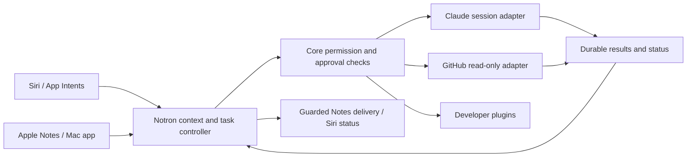

# Notron repositioning design and contracts

Version 1 • September 10, 2026 • Approved direction; proposed interfaces below require implementation.

## 1. Product and precedence

**Siri → Notron → the world.** Siri supplies a familiar invocation surface. Notron owns chosen context, tool selection, durable work, permission checks and useful results. Apple Notes remains memory and delivery; the SwiftUI companion handles connections, tasks and explicit approvals. Notes-only use continues to work. The initial repositioned product serves developers, with a consumer experience later built on the same core.

This document and the active [roadmap](README.md) supersede the older organizer-only product boundary, P04-first mobile assumption and P07's initial consumer pilot. Existing [production contracts](design.md) remain binding except where a specific R task versions an interface. This is an extension of the Python workflow, not a replacement of the Notes graph or a wholesale framework migration.

## 2. Global constraints

- Python 3.11+ and Swift/SwiftUI; macOS 14+ code floor; initial distribution Apple silicon.
- Siri features require the separately qualified OS/device/account configuration; availability checks and branded App Shortcuts fallback are mandatory.
- State root: `~/Library/Application Support/com.m1labs.notron`; private encrypted payloads; Keychain unavailable means pause.
- One active Mac executor per managed account; no phone-to-Mac relay or unattended work while the Mac sleeps is assumed.
- Core inference remains Nebius with NVIDIA Nemotron; external-agent credentials and provider usage are separate, opt-in and disclosed.
- Plugins cannot grant permissions, rewrite policy, bypass prepared outbound content or invoke the Notes writer directly.
- No autonomous shell commands, repository writes, merge, deployment, messaging or payment in the default demonstration.
- Use existing SwiftUI design tokens; new screens must reconcile the existing design documents before implementation.

Verified core defaults in `notron/brain.py`: routing `nvidia/NVIDIA-Nemotron-3-Nano-30B-A3B`; writing/planning `nvidia/nemotron-3-super-120b-a12b`; configured deep tier `nvidia/Nemotron-3-Ultra-550b-a55b`; embeddings `Qwen/Qwen3-Embedding-8B`; vision `openbmb/MiniCPM-V-4_5`. Ultra is optional. Claude provider/model is not yet configured: R00 records the exact selected model, SDK version and permitted credential path. A plugin never silently changes Notron's core provider.

The [hackathon rules](https://nebiusglobalaihackathon.devpost.com/rules) require runtime use of Nebius and an NVIDIA open model, not exclusive inference through Nebius. This corrects older repository wording. Separate external agents still need valid provider authorization. Core model selection is a product constraint, not a claim that the event forbids every other provider.

## 3. Architecture and first workflow



The first workflow uses an explicitly chosen local demo project and GitHub repository. Notron reads an issue, resolves permitted Notes context, delegates analysis to a Notron-owned Claude session and returns a diagnosis plus proposed patch text/artifact. It does not claim a patch was applied or tested. Follow-up “what did it find?” resolves the selected task; ambiguous project/task names trigger clarification before invocation. A second request can reuse an explicitly identified session without silently choosing the most recent session on disk.

The [official Claude session API](https://code.claude.com/docs/en/agent-sdk/sessions) supports query/resume and session history. R00 must qualify the actual installed SDK, cancellation and permission hooks. This does **not** establish the ability to control every already-running terminal session. Owned sessions come first; explicitly selected existing-session history or forks require separate qualification and access. No scanning all projects or reading ambient credentials.

Apple's [App Intents guidance](https://developer.apple.com/videos/play/wwdc2026/240/) is the integration boundary. Typed intents/entities improve discoverability; they do not make Notron Siri's unrestricted internal tool router. R00 measures real availability; R03 retains the existing branded Ask route. A Mac intent does not create an iPhone relay. The product must not depend on an unverified keynote feature or an assumed general-agent schema.

## 4. Plugin contract v1 (R01)

Keep the core permission system, scheduler and Notes executor fixed. Borrow explicit dependency/capability contracts and lifecycle management from [DeepSeek Harness](https://www.deepseek.com/harness/en/), not an all-at-once runtime rewrite. Community installability is not a security boundary. First-party shipped adapters are reviewed and bundled. Developer plugin installation explicitly trusts executable code; do not claim process separation is an OS sandbox. A public untrusted-code marketplace waits for an independently reviewed isolation model.

Create `notron/plugins/contracts.py` and `docs/plugins/protocol-v1.md` together. Python frozen dataclasses serialize to versioned JSON. The protocol uses newline-delimited JSON on stdin/stdout, one request/response per call over a resident supervised process; diagnostic stderr is size-limited and redacted. Pin manifest version, code digest and tool schemas. Reject unknown operations and malformed/oversized messages. No shell interpolation.

```python
# Proposed public value objects; R01 owns implementation and JSON validation.
@dataclass(frozen=True)
class ToolSpec:
    name: str
    description: str
    input_schema: dict
    output_schema: dict
    effect: str  # read | delegate | write

@dataclass(frozen=True)
class Manifest:
    protocol: int
    plugin_id: str
    version: str
    executable: tuple[str, ...]
    tools: tuple[ToolSpec, ...]
    allowed_hosts: tuple[str, ...]
    credential_names: tuple[str, ...]

@dataclass(frozen=True)
class TaskView:
    task_id: str
    request_id: str
    state: str
    summary: str
    result_id: str | None
    delivery_state: str  # not_requested | pending | delivered | needs_review

@dataclass(frozen=True)
class PluginReply:
    status: str  # accepted | running | succeeded | failed | cancelled | unknown
    external_id: str | None
    output: dict
    error_code: str | None
```

Host calls `describe`, `invoke`, `status` and `cancel`. `PluginRunner.describe(manifest: Manifest) -> Manifest` performs the handshake; `PluginRunner.call` handles the remaining operations. Registry validation compares the declared and observed schemas before enabling the connection. Each message carries protocol=1, call_id UUID, operation, task_id, connection_id, tool, arguments, external_id and a bounded execution deadline. Unused fields are null. `describe` returns the validated manifest; the other calls return `PluginReply`. Echo call_id; never use plugin-supplied task IDs as authorization. `invoke` acknowledges admission promptly while the adapter executes in its supervised background job; the host keeps the process alive across subsequent status/cancel calls. Normal replies do not kill the process. Dispatcher shutdown and lost processes follow the recovery rules below. `invoke` with the same task ID and identical arguments must not start twice. Conflicting arguments fail. A connector that cannot resolve an interrupted invocation returns `unknown`, and the host marks `needs_review`.

Connection grants are **host-owned**: connection ID, plugin ID/version/digest, selected repository/project, tool allowlist, approved data destinations, expiry/revocation generation and Keychain credential references. A grant is an encrypted configuration object, not text inside the prompt. R01 forbids executable/path changes through tools. Relative paths resolve within the approved installation/project; reject traversal, symlink escape and unexpected endpoint redirects. Declared host restrictions are enforced by reviewed adapter transport; arbitrary developer code is still trusted local code until real isolation exists.

## 5. Task lifecycle, ownership and budgets (R01)

Create an external-task store rather than changing the meaning of the existing Notes operation ledger. Correlate with `RequestEnvelope.request_id` and preserve `requests.py`/`operations.py` semantics. Existing `RequestEnvelope.source` does not allow `siri`: R03 uses `source='cli'` with a versioned, host-created task ingress field `siri`, avoiding an undocumented incompatible value.

States: `queued → awaiting_approval → running → succeeded | failed | cancelled | needs_review`; direct `queued → running` requires an existing valid grant. `cancel_requested` is an intermediate state from running; it becomes `cancelled` only when acknowledged. Completion after a cancel request is reported as completed, with cancellation too late. A disconnect revokes new calls immediately, requests cancellation and purges local connection-derived content; already transmitted data cannot be recalled.

Create `TaskStore(root: Path, key: bytes)` using SQLite for non-content metadata and `EncryptedStore` for prompts/results/project labels. A unique `(request_id, connection_id, tool)` key protects admission. Persist before external dispatch; lease/fence the dispatcher so only one process sends. Store external session/run IDs before later polling. Crash at an unprovable start boundary → `needs_review`, never optimistic retry. A result can succeed while Notes delivery is `needs_review`; retrying delivery never re-runs the agent.

Create host API in `notron/tasks/controller.py`:

```python
def submit_task(*, request: RequestEnvelope, connection_id: str, tool: str,
                arguments: dict, ingress: str = 'cli') -> TaskView: ...
def get_task(task_id: str) -> TaskView: ...
def list_tasks(*, limit: int = 20) -> list[TaskView]: ...
def approve_task(task_id: str, *, proposal_digest: str) -> TaskView: ...
def cancel_task(task_id: str) -> TaskView: ...
```

`enqueue_request(request: RequestEnvelope, *, ingress: str) -> TaskView` (R02) first persists a parent workflow task with no connection and returns it before model planning. A parent has kind=`workflow`; connector tasks have kind=`tool` and a required connection. `TaskStore.admit_workflow(*, request_id: str, ingress: str) -> TaskView` owns parent deduplication. Never fabricate a plugin connection for the parent. `submit_task` validates/persists and returns without waiting for agent completion. Bind approvals to request, tool, argument hash, project, plugin digest, context sources and grant generation; changed or expired proposals require new approval. Approval expires after 10 minutes. Status reads local state and never launches a model or creates usage charges. Delivery re-enters the existing single Notes worker; it must not hold the Notes lock while waiting for external work. Run at most one external delegation per Mac initially. Invocation maximum 10 minutes, 20 agent turns and a user-visible configured spend cap; R00 must prove enforcement or disable live delegation. Do not invent a hard dollar guarantee if the provider cannot enforce it; report token/turn limits and residual billing exposure before approval.

## 6. Context, security and retained behavior

R01 extends `outbound.Origin` with `external` and adds optional `connection_id` and `resource_id` to `Passage`. Update `sanitized` and every serialization/copy path so provenance survives. Validate current connection/resource grants on every transmission, including retries. Note-derived summaries retain contributing note IDs separately in task context; recheck each source before sending or delivering. External results remain untrusted data and cannot add tools, change policy or approve a plan. Prompt injection fixtures include hostile issues and Claude output.

Reuse P01 encryption and revocation. Retain completed task content for 7 days by default; keep content-free recovery tombstones for 30 days. Explicit delete, connection removal and source revocation purge dependent payloads/index entries and invalidate pending approvals. Disclose that a result deliberately written into Apple Notes remains there until the user deletes it; do not promise deletion at external providers. No automatic permanent-memory writes from agent output. Plugin credentials stay out of argv, payload logs, Notes, repository and model prompts; pass only selected credentials over a protected IPC channel and strip ambient environment.

All existing Notes guards remain: Ignore wins; read permission is not rewrite permission; About Me is user-write-only; photo-bearing notes are not overwritten; uncertain writes require review; existing calendar/reminder action limits remain. Optional calendar/reminder grants must not block developer tasks or Notes-only use. The managed inference transport and storage key gates remain enforced; no early flipping of `protectedManagedStartupValidated`.

## 7. User surfaces and extensibility

R03 adds task entities with stable opaque IDs, list/disambiguation, start/status/cancel intents and concise dialogs. Approval opens the Mac's concrete proposal, showing project, tool, provider and data destinations; no unbound voice “yes” is treated as blanket permission. Sensitive results are not spoken by default. The task screen exposes full results, provider costs when available, cancellation state and Notes-delivery state separately.

R04 ships a manifest validator, local conformance runner, documented examples and a reusable declarative skill `investigate-issue` that invokes only registered tools. Skills are versioned instructions with named inputs/tools, not credentials or policy code. Developers can change integrations and workflows without changing core. Model-provider, storage, loop and UI replacement plus generic MCP servers are future extension categories, not v1 guarantees. The later MCP adapter must pin its supported protocol and treat server tools as untrusted; current [MCP task extensions](https://blog.modelcontextprotocol.io/posts/2026-07-28/) must not be assumed available on every server.

## 8. Definition of done

A task is complete only after targeted tests, affected existing regression tests and required real-device/provider evidence. Mocks are explicitly labeled. P06 signed installation and R05 end-to-end evidence gate the external preview; P05/P07 gates remain for paid production. The [coverage map](coverage.md) assigns every new requirement; unsupported features and failed probes are visible in the handoff. Source references above were checked September 10, 2026; recheck SDK and Apple details during their feasibility task.

## 9. After the hackathon

Sequence by evidence rather than promising all extension points at once:

1. Qualify explicitly selected existing Claude sessions and other agent systems; add a vetted MCP adapter with scoped tools, credentials and task-lifecycle support. Never claim live takeover from a history-only API.
2. Add approved code execution/patch application in an isolated project environment, then a phone-to-awake-Mac relay only after authenticated transport, device routing and real-device tests.
3. Build community distribution: package signing, review, isolated execution, revocation, compatibility policy and transparent trust levels before an automatic marketplace.
4. Expand replaceable model/provider, memory/storage and interface components when multiple real implementations justify stable contracts. Keep core authorization and recovery non-bypassable.
5. Finish P05 staging, P06 updater and P07 cost/consumer evidence before a paid public launch. Pricing and hosted infrastructure are separate decisions.

These are sequenced follow-on themes, not funded commitments or October acceptance requirements. Create bounded implementation plans when the preceding evidence is available.
